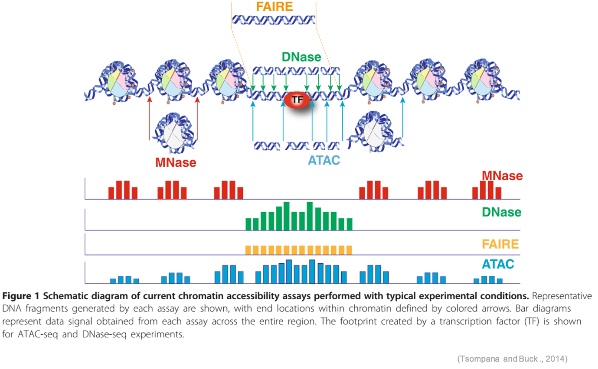
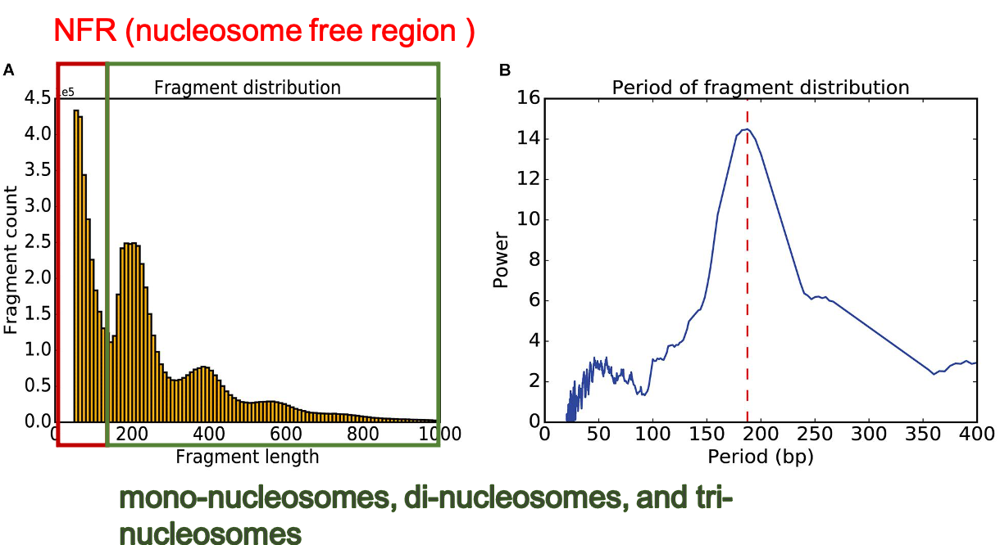
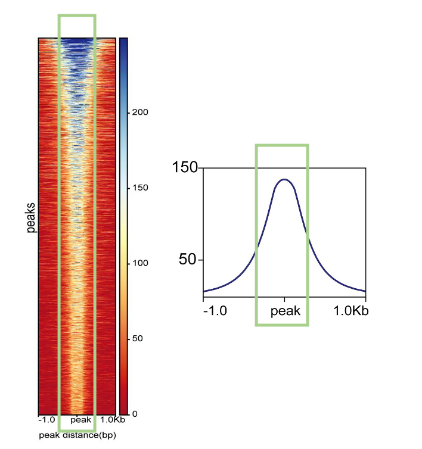
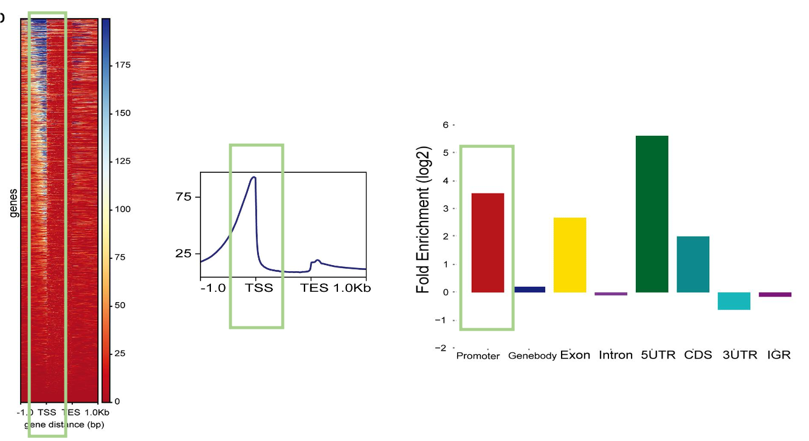

# LSL Course 04 - Analyzing Genome-wide Chromatin Accessibility

Lecturer: Pei-Yu Lin
Dr. Pao-Yang Chen's Lab


## Outline

* [ATAC-seq](#Methods for measuring chromatin accessibility)
* [Data processing pipeline](#Chromatin accessibility analysis workflow)
  * [Preprocessing](#Preprocessing)
  * [Peak calling](#Peak calling)
* [Post-alignment analysis](#Post-alignment analysis)
  * [Accessible regions profiling](#Accessible regions profiling)


## Methods for measuring chromatin accessibility

<p align="center"></p>

## Chromatin accessibility analysis workflow

<p align="center"></p>


## Download and environment setup for ATAC-seq

Download ATAC-seq

```sh
git clone https://github.com/beritlin/ATACgraph.git
cd ATACgraph
```

Create python2.7 environment for ATAC-graph

```sh
sh ./ATACgraph/base.txt
```

Other tools

- deepTools 3.3.0
- [BEDtools](http://bedtools.readthedocs.org/)
- [IDR](https://github.com/nboley/idr)

- [MACS2](https://github.com/taoliu/MACS)


### Example data

```sh
cd ATACgraph/demo
```

#### 01_for_data_processing

* **human** **genome annotation:**
  demo_gene.gtf
* **human** **gene and promoter bed files:** 
  demo_gene_body_bed6.bed

#### 02_for_data_visualisation

* **Raw reads bam file:** 
  demo.bam
* **Raw reads bam index file:** 
  demo.bam.bai
* **BigWig** **file:**
  demo_rmM_peakcall_coverage.bw
* **Peak location BED file:**
  demo_rmM_peakcall_peaks.narrowPeak
* **A genes list of overlapping with peaks locations** **:**
  demo_rmM_peakcall_peak_gene_list.txt

#### **03_for_downstream_analysis**

* **Peak location BED file:**
  demo_rmM_peakcall_peaks.narrowPeak


### Preprocessing

> 20-80% sequences in ATAC-seq are from mitochondria genomes

Remove mitochondria chromosome

```sh
./script/ATACgraph 00_rmChr demo/demo.bam demo/demo_rmM.bam chrM

## Remove chrM 69628 reads
## Remove total 69628 out of 71843 (0.969)
```

* ATAC-seq bam file after removing mitochondria chromosome named demo_rmM.bam


Transform GTF file to BED files

```sh
./script/ATACgraph 02_gtftoBed demo/human_gene.gtf demo/demo -p 2000


##  ----------------------------------
##  | Extract Regions from annotations |
##  |  snf        Fall 2014            |
##   ----------------------------------

##  Building GTF dictionary...
##  Dictionary built.
##  Writing transcript properties.
##  Processed 1083 entries.
```

* 11 BED file (promoter,gene,exon,intron,utr5,cds,utr3,igr) for the generating metagene plots, fold enrichment analysis

  

### Peak calling

```
./script/ATACgraph 03_callPeak demo/demo_rmM.bam demo/demo_rmM_peakcall demo_gene_body_bed6.bed
```

- Peak location BED file (demo_rmM_peakcall_peaks.narrowPeak),
- Peak intensity bigWigfile (demo_rmM_peakcall_coverage.bw)
- A genes list of overlapping with peaks locations (demo_rmM_peakcall_peak_gene_list.txt)


## Post-alignment analysis

### **Fragment length distribution and Fast Fourier Transform (FFT)**

Find fragment

```sh
./script/ATACgraph 01_calFragDist demo/demo_rmM.bam demo/demo_rmM_fragment demo/demo_rmM_FFT
```

- 2 figures (demo_rmM_fragment.png & demo_rmM_FFT.png)

<p align="center"></p>


### **Visualision** **of peaks** 

Peaks analyses

```sh
./script/ATACgraph 03_genePlot demo/demo_rmM_peakcall_peaks.narrowPeak demo/demo_rmM_peakcall_coverage.bw demo/demo  
```

- 3 Figures
  - The enrichment status of accessible region in genome (Fold_Enrichment.pdf)
  - The accessibility – or read abundance – around genes (gene_body_heatmap.pdf)
  - The accessibility – or read abundance – around peaks (Peak_heatmap.pdf)


##### **ATAC-seq** **abundance near the peak regions** 

ATAC-seq enriched at the center of the predicted peak locations

<p align="center"></p>

##### **ATAC-seq** **abundance** **of** **the gene body and flanking regions** 

The accessible regions are located before the transcription start sites (TSSs) in two-thirds of the genes

<p align="center"></p>

